<!-- ====================================================== -->
<!--                 MUBASHAR AHMAD PROFILE                  -->
<!-- ====================================================== -->

<div align="center">

# 👋 Hi, I'm Mubashar Ahmad

### Full-Stack Developer • Game Developer • Interactive 3D Developer


<br/>

<a href="https://devmubashar.com">
  
</a>

<a href="https://linkedin.com/in/mubashar-ahmad-71403820b">
  
</a>

<a href="mailto:devmubashar@gmail.com">
  
</a>

<br/><br/>


</div>

---

# 🚀 About Me

```ts
const mubashar = {
  location: "Pakistan 🇵🇰",

  roles: [
    "Full-Stack Developer",
    "Game Developer",
    "Interactive 3D Developer"
  ],

  frontend: [
    "Next.js",
    "React",
    "TypeScript",
    "Tailwind CSS"
  ],

  gamesAnd3D: [
    "Unity",
    "Three.js",
    "React Three Fiber",
    "Phaser",
    "Blender"
  ],

  backend: [
    "Node.js",
    "PostgreSQL",
    "Supabase",
    "Drizzle ORM"
  ],

  currentlyLearning: "Advanced Blender & 3D workflows",

  interests: [
    "Web Games",
    "Interactive 3D",
    "Game Development",
    "AI Coding Agents",
    "Creative Development"
  ]
};
```

- 🎮 I build **browser games, Unity games and interactive 3D experiences**
- 💻 I develop modern applications using **Next.js, React & TypeScript**
- 🧊 I enjoy creating **Three.js / React Three Fiber** experiences
- 🌱 Currently improving my **Blender and 3D art skills**
- 🤖 Exploring **AI coding agents and AI-assisted development workflows**
- 💼 Available for freelance development projects
- 🌐 Portfolio: **[devmubashar.com](https://devmubashar.com)**
- 📫 Email: **devmubashar@gmail.com**

---

# 🛠️ Tech Stack

## 🌐 Web Development

<div align="center">


</div>

<br/>

## 🎮 Game Development & 3D

<div align="center">


<br/><br/>


</div>

<br/>

## 🗄️ Backend & Database

<div align="center">


<br/><br/>


</div>

<br/>

## 🔧 Tools & Workflow

<div align="center">


</div>

---

# 🎯 What I Build

<div align="center">

| 🌐 Full-Stack Apps | 🎮 Games | 🧊 Interactive 3D |
| :---: | :---: | :---: |
| Next.js Applications | Browser Games | Three.js Experiences |
| React Interfaces | Unity Games | React Three Fiber |
| APIs & Databases | Phaser Games | WebGL |
| Authentication Systems | Mobile Games | Low-Poly Worlds |
| Real-Time Features | Game Mechanics | Blender Assets |

</div>

---

# 💡 Current Focus

```text
🎮 Game Development        ███████████████████░   95%
💻 Full-Stack Development  ███████████████████░   95%
🧊 Interactive 3D          █████████████████░░░   85%
🤖 AI Dev Workflows        ██████████████████░░   90%
🎨 Blender / 3D Art        ████████████░░░░░░░░   60%
```

---

# 📊 GitHub Analytics

<div align="center">




</div>

<br/>

<div align="center">


</div>

> **Note:** GitHub language statistics reflect the languages detected in public repositories and do not necessarily represent overall proficiency.

---

# 🐍 Contribution Activity

<div align="center">

<picture>
  <source
    media="(prefers-color-scheme: dark)"
    srcset="./profile/github-snake-dark.svg"
  />

  <source
    media="(prefers-color-scheme: light)"
    srcset="./profile/github-snake.svg"
  />

  
</picture>

</div>

---

# 🧠 Development Philosophy

<div align="center">

### `"Build it. Break it. Improve it. Repeat."`

I enjoy turning ideas into **working products** — whether that's a full-stack application,  
a browser game, a multiplayer experience or an interactive 3D world.

</div>

---

# 🌐 Connect With Me

<div align="center">

<a href="https://devmubashar.com">
  
</a>

<a href="https://linkedin.com/in/mubashar-ahmad-71403820b">
  
</a>

<a href="mailto:devmubashar@gmail.com">
  
</a>

<a href="https://x.com/DevMubashar">
  
</a>

<a href="https://www.fiverr.com/mubasharahmad34">
  
</a>

</div>

---

<div align="center">

## 🤝 Have an interesting project?

I'm interested in working on **games, web applications, interactive experiences and creative development projects.**

<br/>

<a href="mailto:devmubashar@gmail.com">
  
</a>

<a href="https://devmubashar.com">
  
</a>

<br/><br/>

### ⭐ Thanks for visiting!

<sub>Building web experiences, games and interactive worlds one project at a time.</sub>

</div>
